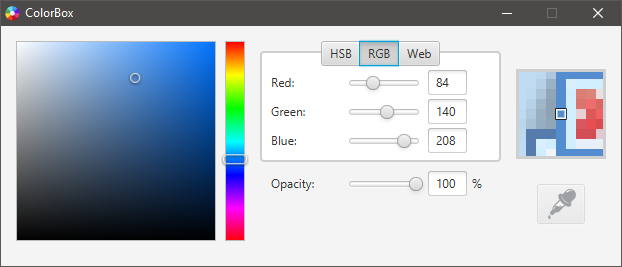

# ColorBox

The Color Box allows the conversion of a color in the HSB, RGB and HTML systems.  
 
A color picker tool who can retrieve a color of a pixel on the screen.  

A visual mode gives the possibility to choose a color in a color chart.

ColorBox uses some functionality of the Custom Color dialog of the JavaFx project.

 

	

